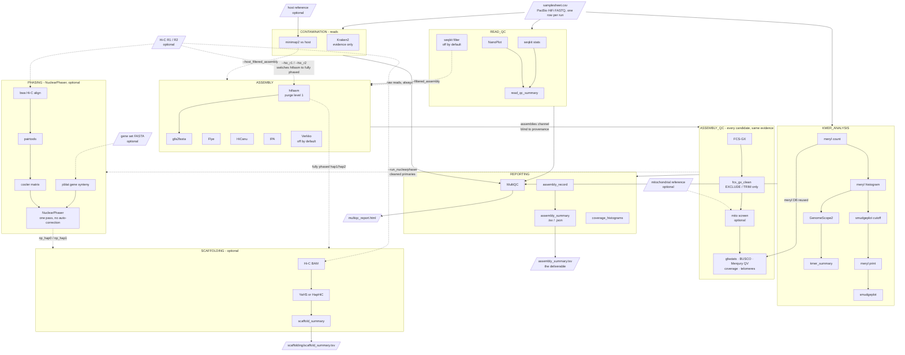

# rust-assembler-nf

[](https://github.com/rj-price/rust-assembler-nf/actions/workflows/ci.yml)
[](https://www.nextflow.io/)
[](LICENSE)

Phased assembly and haplotype resolution of **dikaryotic rust (Pucciniales) genomes** from
PacBio HiFi reads, with optional Hi-C phasing and scaffolding.

This is a **research/decision pipeline**. It deliberately generates several assembly
candidates and the evidence needed to judge which is biologically credible. It does not try
to emit a single "final" FASTA. The dikaryon is the crux: the goal is to *retain* two nuclear
genomes, so every duplication-collapsing step is off by default and gated behind human
judgement.

If you want a pipeline that hands you one polished assembly, this is the wrong one. If you
want to know whether your assembly has quietly collapsed two nuclei into one, it is the right
one.

---

## Why a rust-specific pipeline

Rust fungi are dikaryotic: two genetically distinct haploid nuclei coexist in one cell.
General-purpose assembly pipelines are built around haploid or diploid genomes, and their
defaults actively work against you here:

- **Duplication looks like error, but is the signal.** High BUSCO duplication in an unphased
  rust assembly is usually *correct*. It means both nuclei are present. Pipelines that purge
  duplication to "improve" an assembly destroy exactly what you are trying to keep.
- **hifiasm's default purge level (`-l 3`) is aggressive.** This pipeline defaults to `-l 1`.
- **GenomeScope2 models a diploid.** On a dikaryon its fit degrades, and the fit statistic
  misleads. Coverage modes and smudgeplot are used as independent cross-checks.
- **Read classifiers mis-assign rust reads.** Most rusts are absent from standard Kraken2
  databases, so reads fall back to whatever large repeat-rich genome is nearest. On the bean
  rust dataset this pipeline was built for, Kraken2 called 62% of a demonstrably fungal
  dataset *human*; FCS-GX on the assemblies found no such thing. Classification is therefore
  **evidence, never an automatic filter**, and `--kraken2_confidence` defaults to `0.1` rather
  than Kraken2's own `0.0`, at which a single matching k-mer anywhere in a 15–20 kb HiFi read
  is enough to claim it.

---

## What it does



| Stage | Tools | Notes |
|---|---|---|
| Read QC | seqkit, NanoPlot | Per-run and combined. **No filtering by default.** |
| k-mer analysis | meryl, GenomeScope2, smudgeplot | Before assembly; smudgeplot cross-checks the diploid model |
| Contamination (reads) | Kraken2, minimap2 | Reports only. Nothing is discarded automatically |
| Assembly | hifiasm, Flye, HiCanu, IPA, (Verkko) | Independent approaches; assembly graphs retained |
| Contamination (assembly) | FCS-GX | Post-assembly. Far more reliable than read-level |
| Assembly cleanup | `fcs_gx_clean.py` | Acts on FCS-GX's EXCLUDE/TRIM calls, writing a *new* cleaned FASTA |
| Mitochondrion | BLASTn + `mito_screen.py` | Off by default. Removes the mitochondrion, which FCS-GX cannot see |
| Assembly QC | gfastats, BUSCO, Merqury, minimap2 coverage, telomere scan | Same evidence for every candidate, measured on the cleaned assembly |
| Phasing (optional) | pblat, bwa/pairtools/cooler, NuclearPhaser | Hi-C phasing of **any** assembler's output, not just hifiasm's |
| Scaffolding (optional) | bwa, YaHS or HapHiC | Fully phased haplotypes only; its own table |
| Reporting | MultiQC, `assembly_summary.tsv`/`.json` | Machine-readable comparison |

Every expensive step is a separately-cacheable process, so changing a QC plot never
invalidates a multi-day assembly.

---

## Quick start

Requires Nextflow ≥24.04 and Apptainer. Almost every tool comes from a pinned biocontainer.
Three have no usable public image and are built once from the bundled definitions: IPA (on by
default), NuclearPhaser and HapHiC (only when their branch is used). See
[Locally built containers](#locally-built-containers).

### Running straight from GitHub

Like nf-core pipelines, this runs without cloning. Nextflow fetches the repository into
`~/.nextflow/assets/` and runs it from there:

```bash
nextflow run rj-price/rust-assembler-nf -r v1.0.0 \
    -profile <site> \
    --input samplesheet.csv --genome_size 525m --fcs_gx_taxid 5264 \
    --outdir results
```

- **Always pin `-r`** to a release tag (or a commit). Without it you get whatever is on the
  default branch today, and a `-resume` next week may run different code.
- `nextflow pull rj-price/rust-assembler-nf` updates the cached copy;
  `nextflow info rj-price/rust-assembler-nf` shows which revision you have.
- Custom settings go in your own config, passed with `-c my.config`, not in edits to the
  pipeline. That is also how a dataset profile you do not want to publish is kept private.
- The container definitions are inside the cached copy, e.g.
  `apptainer build ipa.sif ~/.nextflow/assets/rj-price/rust-assembler-nf/containers/ipa.def`.

### From a clone

```bash
git clone https://github.com/rj-price/rust-assembler-nf.git && cd rust-assembler-nf

# 1. Validate the wiring (seconds, no compute, no containers)
nextflow run . --input assets/samplesheet.csv --genome_size 500m \
    --run_kraken2 false --run_busco false --run_fcs_gx false --run_ipa false \
    -profile stub -stub-run

# 2. Smoke test on a subsample (proves containers, DB binds, offline BUSCO)
RAW_DIR=/path/to/your/fastqs bash bin/make_test_data.sh
nextflow run . -profile test,<site>

# 3. Real run on SLURM: submit the driver, never run it on a login node
NF_PROFILE=<site> NF_INPUT=/path/to/samplesheet.csv NF_OUTDIR=$SCRATCH/myrust/results \
    sbatch run_pipeline.sh --genome_size 525m --fcs_gx_taxid 5264
```

### Inputs

A samplesheet CSV, one row per sequencing run. Run identity is preserved through QC so runs
of different character can be compared. Paths may be local or `https://`/`s3://` URLs:

```csv
sample,run,fastq
rust,run1,/path/to/hifi_run1.fastq.gz
rust,run2,/path/to/hifi_run2.fastq.gz
```

### Required parameters

| Parameter | Meaning |
|---|---|
| `--input` | Samplesheet CSV |
| `--genome_size` | Haploid size of **one** nucleus, e.g. `525m`. No default. Rust genomes span ~100 Mb to ~2 Gb |
| `--fcs_gx_taxid` | NCBI taxid of your species. FCS-GX is on by default; or set `--run_fcs_gx false` |
| `--outdir` | Where results go. Defaults to `./results` |

Database and image locations (`--kraken_db`, `--busco_db`, `--fcs_gx_db`, `--fcs_gx_sif`,
`--ipa_sif`) have no portable default. Supply them via a site profile, pass them on the
command line, or disable the tool. `nextflow run rj-price/rust-assembler-nf --help` lists
every option.

---

## Configuration is split three ways

This split is the main thing to understand before running it anywhere new.

| Layer | File | Holds |
|---|---|---|
| **Pipeline** | `nextflow.config`, `conf/base.config` | Everything true of the pipeline: defaults, resources, containers. No cluster paths, no species values. |
| **Site** | `conf/gruffalo.config` | One cluster: database paths, container cache, queue routing, per-user caps, known-bad nodes. |
| **Dataset** | `conf/mlp.config`, `conf/map.config` | One genome: size estimate, taxid, yield, which branches to run. |

Combine them on the command line:

```bash
nextflow run rj-price/rust-assembler-nf -r v1.0.0 -profile mlp,gruffalo --outdir results
```

### Porting to another cluster

Copy `conf/gruffalo.config` to `conf/<yoursite>.config`, change the paths, and add a matching
profile block in `nextflow.config` (or keep it outside the repo and pass it with `-c`). Nothing
else needs editing. On gruffalo itself every path is derived from `$USER` and `$SCRATCH`, so a
second user there needs no changes at all.

Set at minimum: `kraken_db`, `busco_db`, `fcs_gx_db`, `fcs_gx_sif`, `ipa_sif`,
`apptainer_cache`, `container_binds` (bind mounts for anything outside the work directory),
`workDir`, and, if your scheduler needs it, `process.queue`. The generic `slurm` and
`apptainer` profiles are the building blocks.

### Running your own rust

Copy `conf/mlp.config` to a file of your own, set `genome_size`, `fcs_gx_taxid`,
`busco_lineage` and (optionally) `read_yield_bases`, and pass it with `-c`. Or just pass the
values as `--params`.

### Locally built containers

```bash
apptainer build ipa.sif           containers/ipa.def            # --ipa_sif
apptainer build nuclearphaser.sif containers/nuclearphaser.def  # --nuclearphaser_sif
apptainer build haphic.sif        containers/haphic.def         # --haphic_sif
```

Each definition pins its upstream commit and explains why no stock image works. Point the
matching parameter at the result, ideally from your site profile. `--run_ipa false` removes
the only one needed for a default run.

---

## Validation

The pipeline has been run end to end, with no manual steps, on both isolates from
Duplessis et al. (2026), *G3*, [doi:10.1093/g3journal/jkag247](https://doi.org/10.1093/g3journal/jkag247),
whose chromosome-level phased assemblies are the published answer. The dataset profiles
reproduce these runs from public ENA data:

```bash
nextflow run rj-price/rust-assembler-nf -r v1.0.0 -profile mlp,<site> --outdir mlp_results
nextflow run rj-price/rust-assembler-nf -r v1.0.0 -profile map,<site> --outdir map_results
```

hifiasm's Hi-C haplotypes against the published H0/H1, after YaHS scaffolding. The full
published tables, with notes on comparability, are in `assets/reference_metrics_*.tsv`.

| | *M. larici-populina* 98AG31 | | *M. allii-populina* 12AY07 | |
|---|---|---|---|---|
| | **Published H0 / H1** | **Pipeline** | **Published H0 / H1** | **Pipeline** |
| Size (Mb) | 100.80 / 102.64 | 102.69 / 104.26 | 224.03 / 219.39 | 226.1 / 227.4 |
| Chromosome-scale scaffolds (≥1 Mb) | 18 / 18 | 18 / 18 | 18 / 18 | 19 / 18 |
| All scaffolds | 18 / 18 | 42 / 53 | 18 / 18 | 60 / 141 |
| Scaffold N50 (Mb) | 5.74 / 5.42 | 5.54 / 5.60 | 13.31 / 12.91 | 13.14 / 12.64 |
| Largest scaffold (Mb) | 8.24 / 8.67 | 8.24 / 8.62 | 17.52 / 16.99 | 17.52 / 17.00 |
| BUSCO complete / duplicated (%) | 90.5 / 0.5 | 94.0 / 1.1 | 90.7 / 1.1 | 93.7 / 1.4 |
| Merqury QV | — | 73.2 / 69.2 | — | 71.8 / 64.4 |

Chromosome count, N50 and the largest chromosome agree on both genomes. The remaining
difference is small unplaced contigs, which the paper removed by hand; the pipeline leaves
that to you, deliberately (see [Design decisions](#design-decisions)). BUSCO is not strictly
like for like (the paper used BUSCO v5; the pipeline uses BUSCO 6 with `basidiomycota_odb12`).

The other assemblers, on the same data: HiCanu + NuclearPhaser came close behind (correct
haplotype sizes, N50 3–25% lower, and ~70–90 gaps per haplotype); Verkko + NuclearPhaser was
more fragmented and produced one probable misjoin on *M. allii-populina*; Flye's primary was
collapsed on *M. larici-populina* and ~30 Mb short per haplotype on *M. allii-populina*; IPA
was the weakest (QV 40–44, and phase-switched beyond what NuclearPhaser could separate).

---

## Reading the output

The deliverable is **`assembly_summary.tsv`** (and `.json`). Every QC metric in it describes
the **cleaned** assembly (after FCS-GX, and after the mito screen when `--run_mito_screen` is
on), because that is the assembly carried forward. `qc_input` names which one each row
measured (`raw` only when cleaning is off or failed for that assembly), and
`raw_assembly_size`, `cleaning_removed_pct` and the `*_removed` columns keep what cleaning
took out. A large removal is itself evidence about the sample. Judge candidates on:

- **`size_flag`.** Scores assembly size against the expected 2 × `genome_size` dikaryon
  (halved for hap1/hap2, which hold one nucleus each). **`collapsed` means the dikaryon has
  likely been merged into one haploid copy, the specific failure this pipeline exists to
  catch.**
- **The full BUSCO breakdown**, not a single percentage. **High duplication is expected and
  correct** in an unphased dikaryotic assembly. Near-zero duplication at ~1× haploid size
  indicates collapse, not quality. In a phased haplotype, low duplication is the target.
- **Coverage modes.** Expect a mode at the per-haplotype depth. A strong mode at *twice*
  that means collapsed/shared sequence. A mode well below it is worth investigating as
  contaminant.
- **Merqury QV.** Distinguishes "contiguous but erroneous" from "accurate and complete". It
  often does *not* discriminate between good candidates, so do not use it as a ranking, but
  a clear outlier (IPA at QV 40 against 60–73 for the rest, in validation) is informative.
- **FCS-GX.** Assembly-level contamination, and far more trustworthy than read-level
  classification.
- **Telomeres.** `telomere_capped_ends` is the one contiguity measure here that can be read
  against an expectation rather than only compared between assemblies, since a genome has a
  known number of chromosome ends (2 × chromosomes × 2 nuclei for a dikaryon). Recovering most
  of them across thousands of contigs means the deficiency is scaffolding, not sequence.
  `telomere_interstitial_arrays` counts telomeres found *inside* contigs, which indicate
  mis-joins; **zero is the expected value**, and the merge step warns when it is not.
  Set `--telomere_motif` if your species does not use the canonical fungal `TTAGGG`.

**Assemblies are never ranked by N50.** It is reported and nothing more. Contiguity is not
credibility, least of all for a dikaryon.

### Assembly type vocabulary

hifiasm's HiFi-only and Hi-C outputs are **not** equivalent, and the pipeline never conflates
them:

| `assembly_type` | Source |
|---|---|
| `primary` / `alternate` | hifiasm `p_ctg` / `a_ctg`, IPA, Flye, HiCanu, Verkko |
| `partially_phased_hap1/2` | hifiasm HiFi-only `bp.hap1/2` |
| `fully_phased_hap1/2` | hifiasm Hi-C `hic.hap1/2` |
| `…_np_hap0/1` | NuclearPhaser haplotypes of a primary (phasing and scaffolding outputs) |

Expect HiFi-only `bp.hap1`/`bp.hap2` to be an **arbitrary cut rather than two nuclei**,
unbalanced in size, with one haplotype missing genes the other duplicates. That is a real
finding, not a bug. Genuine phasing needs Hi-C.

### Adding Hi-C

No architectural change needed. Supply both reads and hifiasm switches to fully-phased
output:

```bash
nextflow run rj-price/rust-assembler-nf -r v1.0.0 -profile <site> \
    --input samplesheet.csv --genome_size 525m --fcs_gx_taxid <taxid> \
    --hic_r1 R1.fq.gz --hic_r2 R2.fq.gz
```

On its own that only helps **hifiasm**: the other assemblers cannot use Hi-C at all.
NuclearPhaser closes that gap.

### Phasing any assembly with NuclearPhaser

[NuclearPhaser](https://github.com/JanaSperschneider/NuclearPhaser) phases an assembly *after
the fact* into two nuclear haplotypes, using Hi-C contacts plus gene and BUSCO synteny, so one
Hi-C library applies to every candidate. It was designed on dikaryotic rusts, which is
precisely this case.

```bash
nextflow run rj-price/rust-assembler-nf -r v1.0.0 -profile <site> ... \
    --hic_r1 R1.fq.gz --hic_r2 R2.fq.gz \
    --run_nuclearphaser --nuclearphaser_genes genes.fa \
    --nuclearphaser_sif nuclearphaser.sif
```

Four things to know before relying on it:

- **It needs a gene set** (`--nuclearphaser_genes`): nucleotide gene sequences to map onto the
  assembly for the synteny signal. A published gene set from a related rust is the usual
  source; validation used the *M. larici-populina* v1 CDS from NCBI RefSeq for both species.
- **It only makes sense on an assembly holding both nuclei.** Targets are chosen by
  `--nuclearphaser_targets` (cleaned primaries by default), and any whose cleaned size marks
  it `collapsed` is skipped with a warning, because there is nothing to phase and
  NuclearPhaser crashes on it. `--nuclearphaser_skip_collapsed false` forces it.
- **It runs one pass, deliberately.** The published method is two passes with a *manual*
  phase-switch correction in between. The pipeline stops after pass one rather than
  automating that judgement, and publishes the phase-switch files for inspection. Re-enter
  with `--qc_only` and a corrected assembly for the second pass. When NuclearPhaser reports
  more than two haplotype groups, the assembly is too phase-switched to split; that is a
  result about the assembly, not a pipeline fault.
- **Two tools in the published recipe were substituted**, because neither BioKanga (which is
  also unmaintained) nor HiC-Pro has a container anywhere. `pblat` produces the same PSL that
  BioKanga `blitz` does, and `cooler dump --join` produces the same 7-column contact map that
  HiC-Pro plus hicexplorer does. NuclearPhaser reads both files positionally, so what it sees
  is unchanged. The module headers spell out the reasoning.

### Scaffolding phased haplotypes into chromosomes

Phasing says *which nucleus* a contig belongs to. Scaffolding says *where in that nucleus* it
sits, and it is what makes a scaffold N50 comparable with published assemblies.

```bash
nextflow run rj-price/rust-assembler-nf -r v1.0.0 -profile <site> ... \
    --hic_r1 R1.fq.gz --hic_r2 R2.fq.gz --run_scaffolding
```

- **Nothing is invented.** A scaffolder orders and orients contigs that are already assembled
  and pads each join with Ns. It cannot rescue a bad assembly and cannot inflate a good one.
- **Fully phased haplotypes only**, by default (`--scaffold_targets`): hifiasm's Hi-C
  `fully_phased_hap1/2` and NuclearPhaser's `np_hap0/1`. Two things are excluded on purpose. A
  *collapsed dikaryotic primary* is not a well-posed target: both nuclei are present and the
  scaffolder cannot tell which of two homologous contigs a contact belongs to. Neither are
  hifiasm's HiFi-only `partially_phased_hap1/2`, for the same reason.
- **The result lands in `scaffolding/scaffold_summary.tsv`**, its own table with its own MultiQC
  section. `n_chromosome_scale` is the number to read: gfastats reports `# scaffolds: 53` for
  *M. larici-populina* hap1, counting 35 small unplaced contigs alongside the 18
  chromosome-scale scaffolds that are the actual result. The cut is
  `--scaffold_chromosome_min_length` (1 Mb by default, reporting only — it changes no sequence
  and no decision); `l90` is reported beside it and needs no threshold. Each row also carries
  its own `contig_n50`, because scaffold vs contig N50 *within a row* is the only N50
  comparison here that means anything. Like `assembly_summary.tsv`, these rows describe the
  *cleaned* assembly.
- **Scaffolds are published under `scaffolding/` and never re-enter the candidate comparison.**
  Ranking a scaffolded assembly against contig-level ones on N50 compares two different
  things (D7).
- **Two scaffolders.** `--scaffolder yahs` (default) needs nothing extra. `--scaffolder haphic`
  was built for haplotype-phased and polyploid assemblies, but needs its container and an
  expected chromosome count **per haplotype**:

```bash
nextflow run ... --run_scaffolding --scaffolder haphic \
    --haphic_sif haphic.sif --scaffold_n_chromosomes 18
```

  HapHiC clusters contigs into *exactly* that many groups, so a wrong number does not degrade
  gracefully — it produces confidently wrong chromosomes. For *M. larici-populina* that is 18
  per haplotype, not the 36 of the dikaryon.

  **Both have been run on the same data, and they agree.** On *M. larici-populina* hifiasm
  hap2, against the same Hi-C BAM at 18 chromosomes: 43 sequences and 102.74 Mb from each, N50
  5.55 (HapHiC) vs 5.54 Mb (YaHS), the same contigs in the top five bar a single join. On an
  assembly this contiguous HapHiC logs `--nclusters (18) is greater than the number of clusters
  (11) after reassignment`, because most chromosomes are already single contigs. HapHiC earns
  its keep on *fragmented* phased assemblies; YaHS is the default because well-phased HiFi
  haplotypes are not that.

### Removing the mitochondrion

FCS-GX will not find it. FCS-GX asks whether a sequence comes from a **different organism**,
and the mitochondrion comes from this one — it is the right sequence in the wrong assembly.
Left in, it inflates assembly size, accounts for the one contig sitting at many times nuclear
depth, and pads the contig count.

```bash
nextflow run ... --run_mito_screen \
    --mito_reference https://ftp.ncbi.nlm.nih.gov/refseq/release/mitochondrion/mitochondrion.1.1.genomic.fna.gz
```

This follows Duplessis et al. (2026): BLASTn against the NCBI RefSeq mitochondrial genome
database with DUST masking at ≥90% identity. A contig is called mitochondrial when at least
`--mito_min_aligned_frac` (0.2) of **its own length** aligns and it is under
`--mito_max_length`.

The fraction test is what protects chromosomes. Nuclear-mitochondrial insertions (NUMTs) are
common and can align over many kilobases, but they sit inside chromosome-scale contigs, so
the fraction of such a contig that is mitochondrial stays tiny. A raw alignment-length
threshold would delete a whole chromosome because 8 kb of it is an ancient insertion.

**DUST masking is not optional, and the thresholds are measured.** An earlier version of this
used `minimap2 -x asm20`, which has no identity floor. On *M. larici-populina* it called 31
contigs and 3.41 Mb of hap1 mitochondrial — against a true mitogenome of 47 kb on one contig.
The false calls were tandem-repeat arrays chaining onto unrelated mitogenomes at ~14%
identity. Mitogenomes and fungal repeat arrays are both AT-rich, so without low-complexity
masking the search matches composition rather than homology. With BLASTn, DUST and ≥90%
identity:

| contig | length | aligned fraction | call |
|---|---|---|---|
| `h1tg000096c` | 46,847 | 0.349 | MITO — circular, GC 30.4% vs 41% nuclear, 522× vs 207× depth |
| `h1tg000270c` | 93,694 | 0.349 | MITO — exactly 2× its length, a concatemer of the same molecule |
| next best | — | 0.078 | KEEP |

hap2 gives the identical 46,847 bp contig at 0.349, next best 0.068. One mitochondrial
molecule, as a dikaryon should have. The default threshold sits in a measured gap, not a
guessed one.

The safeguards are FCS_GX_CLEAN's: the input assembly is never modified, the removed contigs
are written out rather than deleted, and every contig with *any* alignment is recorded in the
manifest with its call and the reason for it — so NUMTs and near misses stay visible.

### Comparing derived datasets

Questions the pipeline can answer rather than assume, all off by default because each adds
assemblies:

```bash
# Did removing apparent host contamination actually improve the assembly? (Often: no.)
--host_reference host.fa --host_filtered_assembly

# Did quality/length filtering actually improve the assembly? (Often: no. See D2.)
--min_read_q 30 --filtered_assembly

# Is each sequencing run earning its place? Assembles every run alone as well as pooled.
--subset_assemblies
```

Each produces extra hifiasm `readset`s (`host_filtered`, `filtered`, or one per run)
assembled *alongside* the raw `all` readset, never instead of it, since the comparison is the
whole point, and carried through the full QC fan-out as ordinary candidates. Raw FASTQs are
never touched.

---

## Design decisions

These are deliberate. Code comments refer to them by number, so read the reasoning before
changing one.

| # | Decision | Reasoning |
|---|---|---|
| D1 | **No purge_dups stage** | On a pipeline whose purpose is retaining two nuclear genomes there is no setting of it that makes sense. hifiasm's own duplication handling, tuned by `--hifiasm_purge_level` (D11), is the only purging. |
| D2 | **No quality or length filtering by default** | Long reads with a poorer reported Q are often the ones doing the phasing work. On the dataset this was built for, the reads a Q30 filter would have discarded gave better-balanced haplotypes. Filters only ever create a *separate* dataset. |
| D3 | **Containers first** | Pins every tool version and removes installation from the user's problem. |
| D4 | **FCS-GX rather than BlobToolKit** for assembly-level contamination | NCBI's own screen, with a single database and image to provide. |
| D5 | **`pucciniomycetes_odb12`** as the default BUSCO lineage, BUSCO pinned to 6.x | Correct clade for a rust; odb12 lineages cannot be read by BUSCO 5. |
| D6 | **Raw FASTQs and assemblies are never modified** | Filtering, host removal and cleanup write *new* files. Source data cannot be destroyed by a pipeline run. |
| D7 | **Never rank assemblies by N50** | Contiguity is not credibility, least of all for a dikaryon. |
| D8 | **No reference-guided scaffolding or polishing** | They bake in outside assumptions before the assembly is understood. De novo Hi-C scaffolding of phased haplotypes adds no outside information, so it is available opt-in, with its output kept out of the candidate comparison. |
| D9 | **Expensive diagnostics are wired but off by default** | Verkko, per-run subsets, host-filtered and filtered readsets. Enabling one is a parameter flip, not a redesign. |
| D10 | **Read classification is evidence, never a filter** | Kraken2 mis-assigns rust reads badly (see [above](#why-a-rust-specific-pipeline)). |
| D11 | **`hifiasm -l 1`**, not hifiasm's default of 3 | The aggressive default collapses haplotypic duplication, the opposite of the goal. `-l 0` may suit a highly heterozygous dikaryon. |
| D12 | **Small unplaced scaffolds are never removed automatically** | Dropping sequence to match a chromosome count is a curation decision that needs a reason, so it is left to the user. |
| D13 | **Assembly cleanup acts only on FCS-GX EXCLUDE and TRIM** | The one stage that *acts* on a contamination call, so it is deliberately narrow: REVIEW and INFO are recorded and left alone, because on a dikaryon "unusual" is not "contaminant". Removed sequence is kept in `derived/`. |
| D14 | **NuclearPhaser runs one pass** | Its manual phase-switch correction is a human judgement and is not automated; the pipeline publishes the evidence for it. |

---

## Editing the pipeline

Four traps here fail **silently**, or only on real data hours into a run, so they are enforced
rather than documented. Run the guard after touching any config, module or `bin/` script:

```bash
python3 bin/check_config_selectors.py
```

| Rule | Why it is a rule |
|---|---|
| Declare a process's container **and** its resources together, in one `withName:` block in `conf/base.config`. | Nextflow does not deep-merge `withName:`/`withLabel:` blocks across files — the later file replaces the earlier wholesale, silently. |
| Write parse-time directives (`container`, `queue`, `clusterOptions`) as a closure: `container = { params.fcs_gx_sif }`. | A config is evaluated as it is parsed. `conf/base.config` is read before any profile, so a bare `params.x` bakes in `null` and the task runs uncontainerised on the bare host. |
| `chmod +x` any new `bin/` script, and give it a shebang. | Nextflow puts `bin/` on the task `PATH` but does not chmod it, so a non-executable script dies with exit 126. Stub runs `touch` their outputs instead of calling it, so the smoke test passes and the failure waits for real data. |
| No lone `\n` / `\t` in a process `script:` block — including in its comments. | The block is a Groovy string before it is a shell script, so Groovy eats the escape first and the result is a syntax error. |

Every one of these cost a real run.

---

## Profiles

| Profile | Purpose |
|---|---|
| `gruffalo` | Site: Crop Diversity HPC (SLURM + Apptainer + its databases). The worked example of a site profile |
| `slurm` / `apptainer` | Building blocks for your own site profile |
| `mlp` | Dataset: *Melampsora larici-populina* 98AG31, full validation run from ENA |
| `map` | Dataset: *Melampsora allii-populina* 12AY07, full validation run from ENA |
| `test` | Smoke test on subsampled reads, proves containers and DB binds |
| `stub` | Wiring validation only, runs on one core |
| `robust` | Failure isolation for long unattended runs. **Always check the trace afterwards**. It converts failures into gaps |
| `debug` | Keeps work dirs, dumps task hashes |

Combine with commas: `-profile mlp,gruffalo,robust`.

### A note on `robust`

It converts most task failures into `ignore`, so one bad QC step cannot prevent multi-day
assemblies from ever being submitted. The cost is that failures become silent gaps in the
summary rather than a failed run. After any robust run:

```bash
awk -F'\t' '$5=="FAILED"' <outdir>/pipeline_info/execution_trace.txt
```

Do not use it while developing.

---

## Repository layout

```
main.nf                  workflow entry point, help text, parameter validation
nextflow.config          pipeline defaults + profile definitions
run_pipeline.sh          SLURM driver script for a real run
conf/
  base.config            resources AND containers, together, per process
  apptainer.config       container runtime settings
  slurm.config           generic SLURM execution
  gruffalo.config        SITE example: cluster paths, queues, caches, bad nodes
  mlp.config, map.config DATASET examples: the two validation genomes
  test.config            smoke test on subsampled reads
  stub.config            wiring validation only
  robust.config          failure isolation for unattended runs
lib/GenomeSize.groovy    genome-size arithmetic shared by modules
subworkflows/local/      READ_QC, KMER_ANALYSIS, CONTAMINATION, ASSEMBLY, ASSEMBLY_QC,
                         PHASING, SCAFFOLDING, REPORTING
modules/local/           one process per tool
bin/                     summary scripts (python 3.6-compatible) + check_config_selectors.py
assets/                  samplesheets, published reference metrics, NO_FILE_* placeholders
containers/              Apptainer definitions for IPA, NuclearPhaser and HapHiC
.github/workflows/       CI (stub runs, config guard, lint) and tagged releases
```

CI runs on every push: the config guard, then stub runs of the default and all-branches
configurations on the oldest and newest supported Nextflow. Stub runs prove the wiring, not
the tools; the `mlp`/`map` validation on real data is run by hand before each release.

---

## Licence

MIT, see [LICENSE](LICENSE).

## Citation

If you use this pipeline, please cite the tools it runs (listed in each run's
`versions.yml`), and Duplessis et al. (2026) for the phasing and mitochondrial-screening
methods it follows.
